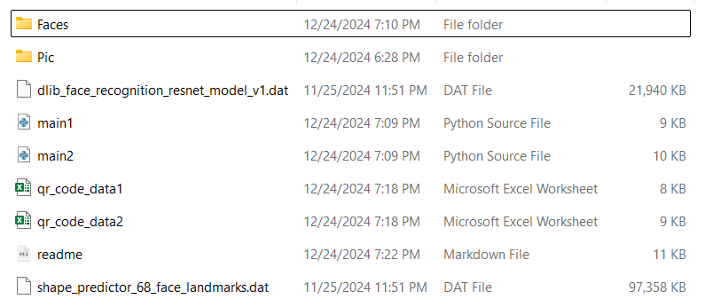
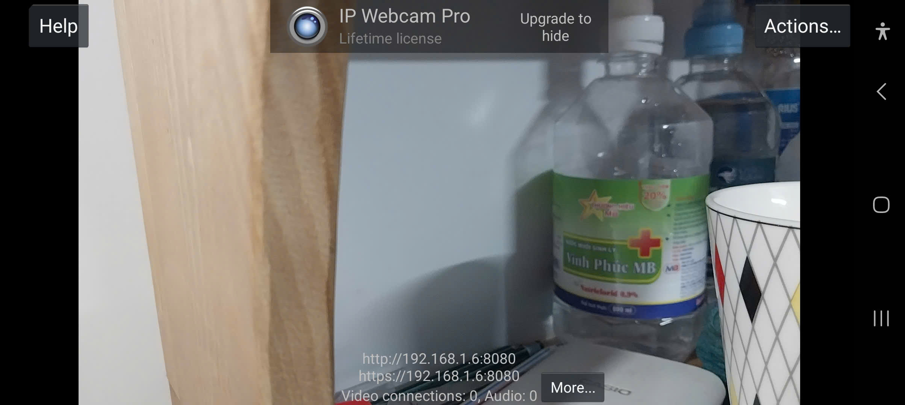

# CCCD Extracting System

## Setup

First, download WSL from https://learn.microsoft.com/en-us/windows/wsl/install

After setting up WSL, download GitHub zip folder from https://github.com/HaiHoang433/AIOT1

The initial folder:



Go to WSL:

```bash
haicn@HaiCN:~$ cd /mnt/c/Users/HoangHai/Desktop/AIOT1-main # Your Folder Location
haicn@HaiCN:/mnt/c/Users/HoangHai/Desktop/AIOT1-main$ ls
Faces
Pic
dlib_face_recognition_resnet_model_v1.dat
main1.py
main2.py
qr_code_data1.xlsx
qr_code_data2.xlsx
readme.md
shape_predictor_68_face_landmarks.dat
```

```bash
haicn@HaiCN:/mnt/c/Users/HoangHai/Desktop/AIOT1-main$ python3 -m venv venv
haicn@HaiCN:/mnt/c/Users/HoangHai/Desktop/AIOT1-main$ source venv/bin/activate
(venv) haicn@HaiCN:/mnt/c/Users/HoangHai/Desktop/AIOT1-main$
```

In `venv` virtual environment,

```bash
$ pip install opencv-python-headless pandas dlib numpy pyzbar Pillow openpyxl
$ sudo apt update
$ sudo apt install -y libgtk2.0-dev pkg-config
$ pip uninstall opencv-python-headless
$ pip install opencv-python
$ sudo apt update
$ sudo apt install libzbar0Y
```

Link: 

- [dlib_face_recognition_resnet_model_v1.dat](https://github.com/ageitgey/face_recognition_models/blob/master/face_recognition_models/models/dlib_face_recognition_resnet_model_v1.dat)
- [shape_predictor_68_face_landmarks.dat](https://github.com/italojs/facial-landmarks-recognition/blob/master/shape_predictor_68_face_landmarks.dat)

Now you can run the system by 

```bash
$ python3 main1.py # System 1
$ python3 main2.py # System 2
```

In the phone, download Ip Webcam App https://play.google.com/store/apps/details?id=com.pas.webcam&hl=vi&pli=1

You can see the IP Address of the camera phone:



Copy and paste it into the `IP_CAMERA_URL` in `main1.py` and `main2.py`. For example,

```python
# Define IP camera URL
IP_CAMERA_URL = "https://192.168.1.6:8080/video"
```


## main1.py

The laptop and the phone MUST HAVE the same wifi access. If not or can't connect, there will be errors.

IN ONE RUNNING PROCESS, if the next CCCDs existed in the Excel but have its QR scanned, the system will respond "Duplicate!!!"


## main2.py

The laptop and the phone MUST HAVE the same wifi access. If not or can't connect, there will be errors.

IN ONE RUNNING PROCESS, if the next CCCDs existed in the Excel but have its QR scanned, the system **<u>WON'T</u>** respond "Duplicate!!!"
